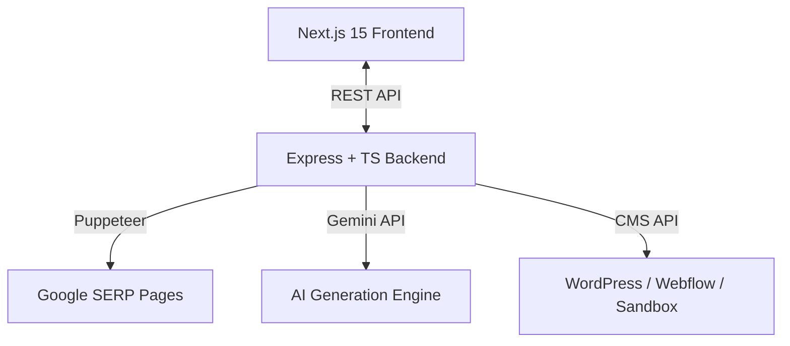

# Agentic SEO & Content Autopilot

An AI-powered content marketing platform that automates competitor SERP analysis, generates semantically optimized article outlines, and publishes long-form HTML content to CMS platforms — all with human-in-the-loop editorial control.

Built with **Next.js 15**, **Express + TypeScript**, **Puppeteer**, and **Google Gemini**.

---

## How It Works



**Pipeline:** Target keyword → Scrape top-ranking competitors → Extract heading structures → Generate semantic outline → Human review & editing → AI-drafted article with Schema.org FAQ markup → Publish to CMS.

---

## Features

### Content Pipeline
- **Competitor Scraper:** Puppeteer-based headless browser queries Google, extracts top-ranking URLs, and deep-crawls their heading structures and content patterns.
- **Outline Editor:** Interactive dashboard where users can add, reorder, modify, or delete structural headings before drafting begins.
- **AI Copywriter:** Generates long-form HTML articles with configurable tone (Professional, Casual, Academic, Sales) and automatic `FAQPage` JSON-LD injection.
- **Live SEO Scorer:** Client-side scoring engine (0-100) evaluating headings, word count, and keyword density in real time as content is drafted.

### Agentic Workflows
- **GEO Citation Scorer:** Evaluates generated content against generative search engine citation patterns. Calculates a GEO Score, extracts semantic entities, and recommends content enhancements.
- **Multi-Agent War Room:** Visual real-time dashboard showing parallel agent execution — Orchestrator, Researcher, Strategist, Writer, Designer, and Technical SEO Auditor working collaboratively.
- **Competitor Watcher:** Parses competitor sitemaps and RSS feeds to identify new content, then generates counter-offensive topic cluster plans with pillar posts and supporting articles.
- **Self-Reflection Recovery:** Monitors keyword ranking changes, compares underperforming posts against live competitors, and generates revision drafts with improved semantic coverage.

### Publishing
- **Multi-CMS Support:** WordPress REST API, Webflow CMS v2 API, and a local simulation sandbox for offline testing.
- **One-Click Export:** Copy raw HTML or download as `.html` file directly from the dashboard.

---

## Technical Decisions

| Decision | Rationale |
|----------|-----------|
| Puppeteer over API-based scrapers | Direct DOM access enables heading structure extraction that API endpoints don't expose |
| Two-stage generation (outline → draft) | Separating structure from content lets humans refine direction before committing AI tokens |
| Schema.org injection in generation | FAQPage markup is embedded during drafting rather than post-processed, ensuring structural consistency |
| Vanilla CSS over Tailwind | Full control over layout system, theme tokens, and animation timing |

---

## Project Structure

```
├── backend/
│   └── src/
│       ├── services/
│       │   ├── scraperService.ts    # Puppeteer SERP crawling & heading extraction
│       │   ├── geminiService.ts     # Prompt engineering & JSON-LD schema injection
│       │   └── publishService.ts    # WordPress, Webflow & sandbox CMS clients
│       └── server.ts               # Express routes & orchestration
│
└── frontend/
    └── src/
        ├── app/
        │   ├── page.tsx             # Main dashboard with multi-stage workflow UI
        │   └── globals.css          # Design system tokens & layout
        └── ...
```

---

## Setup

### Prerequisites
- Node.js v18+
- Google Gemini API Key

### Backend
```bash
cd backend
cp .env.example .env
# Add your GEMINI_API_KEY to the .env file
npm install
npm run dev
```
Server runs on `http://localhost:5001`

### Frontend
```bash
cd frontend
npm install
npm run dev
```
Dashboard available at `http://localhost:3000`

---

## License

MIT
